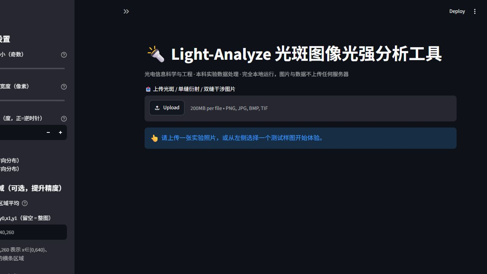
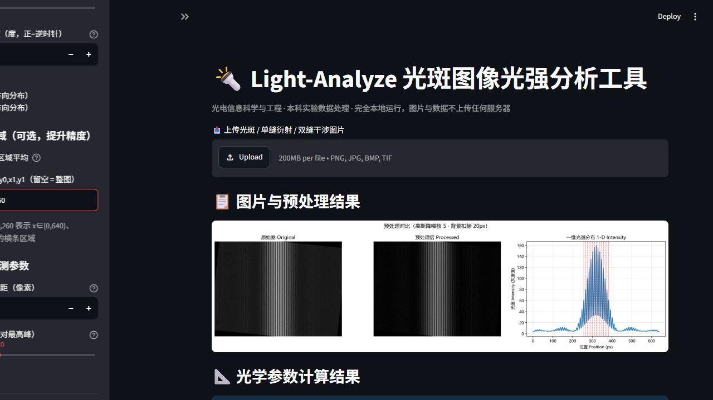
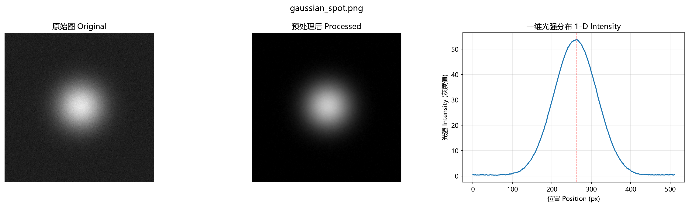
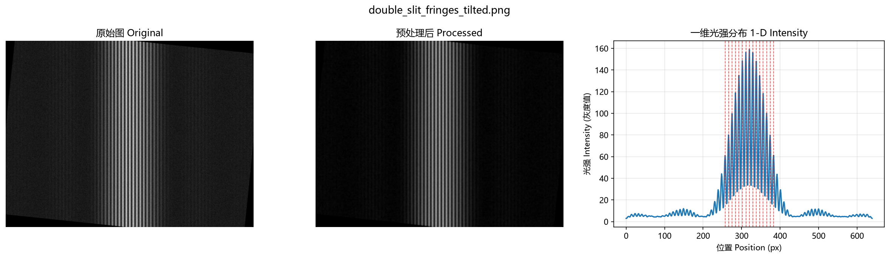
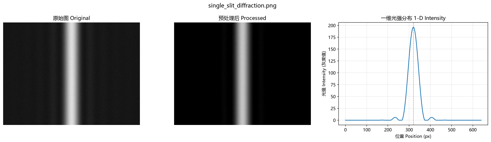

# 🔦 Light-Analyze：光斑图像光强分析可复用 Skill 工具

> 物光创新实验室 · 本科生开源项目 · 光电信息科学与工程专业适配
>
> 定位：轻量化、完全本地运行、可复用 Skill 化的光学实验数据处理工具
>
> 难度：中等普通 · 不晦涩、不前沿小众 · 适合本科结项与招新展示

---

## 一、项目简介

在光电实验、物理光学实验中，我们经常需要拍摄**激光光斑**、**单缝衍射**、
**双缝干涉**条纹图片，并从中读出光斑中心、光斑半径、条纹间距等光学参数。
传统做法是用 Matlab / Origin 手动框选、手动拟合、手动导出，步骤繁琐、
重复性高、且软件授权与操作门槛都较高。

**Light-Analyze** 用 Python 实现了这条完整流水线：

```
上传实验照片 → 灰度化 → 高斯降噪 → 背景杂光扣除
→ 一维光强分布曲线 → 光斑中心 / 半径 / 条纹间距 → CSV 与效果图导出
```

项目坚持三个原则：

1. **完全本地运行**：网页 UI 由 Streamlit 驱动，图片与数据不出本机，不上传任何服务器；
2. **可复用 Skill 架构**：所有算法封装在 `skill/` 独立模块中，脱离网页也能单行调用，
   可嵌入到自己的数据处理脚本、批量处理流程里；
3. **难度适中、不堆砌功能**：只做光学实验数据处理最常用的 4 项核心功能，
   不涉及硬件驱动、不调用 AI 大模型识别，全部为经典图像处理算法，
   本科生完全可自主复现、自主讲解。

---

## 二、核心功能（只做 4 项）

| 序号 | 功能 | 说明 |
| --- | --- | --- |
| 1 | 图片上传与预处理 | 支持 png/jpg/bmp/tif 等常见格式，自动完成灰度化、高斯降噪、背景杂光扣除，并展示"处理前 / 处理后"对比 |
| 2 | 一维光强分布提取与绘图 | 沿 x 或 y 方向提取光强曲线，支持 ROI 区域平均提升精度，曲线自动绘图展示 |
| 3 | 光学参数自动计算 | 光斑中心坐标（光强加权质心）、光斑半径（RMS 半径 + 1/e² 半径）、干涉条纹平均间距 |
| 4 | 结果导出 | 一维光强数据导出 CSV（含峰值位置与间距），预处理对比效果图导出 PNG，一键下载或保存到 demo/ 目录 |

---

## 三、技术栈

| 类别 | 选型 | 用途 |
| --- | --- | --- |
| 语言 | Python 3.9+ | 全部实现 |
| 图像处理 | OpenCV (`opencv-python`) | 读取、灰度化、高斯降噪、旋转校正 |
| 数值计算 | NumPy | 光强提取、质心、二阶矩、峰值检测 |
| 绘图 | Matplotlib | 对比效果图、光强曲线、导出 PNG |
| 网页 UI | Streamlit | 本地交互界面（上传、参数、展示、下载） |

> 依赖仅 4 个，安装一行搞定，无 GPU、无数据库、无服务端框架。

---

## 四、项目结构

严格按照固定目录结构生成：

```
light-analyze-skill/
├── main.py                # Streamlit 网页交互入口（UI 层）
├── skill/                 # 核心可复用 skill 模块（重点，纯算法、零 streamlit 依赖）
│   ├── __init__.py        # 包标记文件（保证 IDE / 打包工具能正确识别为 Python 包）
│   ├── image_io.py        # 图片读取（兼容中文路径）、灰度化、高斯降噪、背景扣除、旋转校正
│   ├── light_calc.py      # 光强提取、光斑中心计算、光斑半径、条纹峰值与间距算法
│   └── export_result.py   # 绘图（对比图）、导出 CSV / PNG
├── test_img/              # 测试用光斑样图（3 张，程序合成模拟真实实验照片）
├── demo/                  # 运行截图与效果展示（本 README 的效果展示位）
└── README.md              # 项目文档（本文件）
```

**分层设计**：`main.py`（UI 层）只负责"上传 → 传参 → 调 skill → 展示 → 下载"；
`skill/`（Skill 层）只负责算法，二者通过函数调用解耦，
这就是踩坑点 #4 的最终落地形态。

---

## 五、快速开始（运行教程）

### 5.1 环境要求

- Windows / macOS / Linux 均可
- Python 3.9 及以上（建议 3.10+）
- 无需联网（首次安装依赖除外）

### 5.2 安装依赖

在项目根目录打开终端，执行：

```bash
pip install opencv-python numpy matplotlib streamlit
```

### 5.3 启动网页工具

```bash
cd light-analyze-skill
streamlit run main.py
```

启动成功后，浏览器会自动打开 `http://localhost:8501`，
看到如下界面即说明环境就绪：



### 5.4 使用步骤

1. **上传图片**：点击"上传光斑 / 单缝衍射 / 双缝干涉图片"，选择一张实验照片；
   也可以从左侧"测试样图快速体验"下拉框直接选 `test_img/` 里的样图；
2. **调节参数**（侧边栏）：
   - 高斯降噪核大小：噪点严重时可调大到 7 或 9；
   - 背景采样边缘宽度：一般 20 即可；
   - 旋转校正角度：条纹拍倾斜时输入校正角度（正=逆时针）；
   - 光强提取方向：竖直条纹选 x（水平方向分布），水平条纹选 y；
   - ROI 区域：在条纹上框一个矩形条带做平均，抗噪抗倾斜；
   - 峰高阈值 / 最小间距：条纹检测的伪峰过滤参数；
3. **查看结果**：右侧显示"原图 / 预处理后 / 一维光强曲线"三联对比图，
   以及光斑中心、RMS 半径、1/e² 半径、条纹平均间距等指标；
4. **导出**：点击"下载光强数据 CSV"或"下载对比效果图 PNG"，
   也可点击"保存到项目 demo/ 目录"。

---

## 六、Skill 独立调用（脱离网页复用）

`skill/` 不依赖 streamlit，任何 Python 脚本都可以直接调用，这是本项目
"可复用 Skill" 的核心卖点。示例：

```python
# demo_use_skill.py —— 脱离网页，纯脚本调用
import sys
sys.path.insert(0, r"你的路径\light-analyze-skill")   # 把项目根目录加入搜索路径

from skill import image_io, light_calc, export_result

# 1) 读图 + 预处理：灰度化 → 高斯降噪 → 背景扣除
gray = image_io.to_gray(image_io.load_image("test_img/gaussian_spot.png"))
denoised = image_io.gaussian_denoise(gray, ksize=5)
processed = image_io.subtract_background(denoised, margin=20)

# 2) 一维光强分布
positions, profile = light_calc.extract_1d_profile(processed, axis="x")

# 3) 光学参数
cx, cy = light_calc.compute_centroid(processed)
rms_r, r1e2 = light_calc.compute_spot_radius(processed, center=(cx, cy))
spacing, peaks, _, _ = light_calc.compute_fringe_spacing(processed, axis="x")

print(f"光斑中心 = ({cx:.1f}, {cy:.1f})")
print(f"RMS 半径 = {rms_r:.2f} px,  1/e² 半径 = {r1e2:.2f} px")
print(f"条纹平均间距 = {spacing} px,  峰数 = {len(peaks)}")

# 4) 导出 CSV 与对比图
export_result.export_csv("output.csv", positions, profile, peaks=peaks, spacing=spacing)
export_result.plot_comparison(gray, processed, positions, profile,
                              peaks=peaks, save_path="output.png")
```

> 这样写的好处：把同一个 skill 批量跑 100 张实验照片、或者嵌入自己的
> 数据处理流程，都不需要打开网页，一行 import 即可复用。

---

## 七、算法流程说明

```
输入图片
   │
   ▼
① 灰度化        color → gray（光强 = 灰度值）
   │
   ▼
② 高斯降噪      GaussianBlur，抑制传感器 / 环境随机噪声
   │
   ▼
③ 背景扣除      四周边框采样 → 背景均值 → 原图减背景（踩坑点 #1）
   │
   ▼
④ 旋转校正      可选，校正倾斜条纹（踩坑点 #2 辅助手段）
   │
   ▼
⑤ 一维光强提取  沿 x / y 方向，ROI 内多行 / 多列平均（踩坑点 #2）
   │
   ▼
⑥ 参数计算
   ├─ 光斑中心：光强加权质心  cx = Σ(I·x)/ΣI
   ├─ 光斑半径：二阶矩  E[r²]=Σ(I·r²)/ΣI → σ=√(E[r²]/2)
   │             RMS 半径 = σ，1/e² 半径 = 2σ（高斯光斑近似）
   └─ 条纹间距：先平滑 → 局部极大值 → 阈值+最小间距筛选 → 平均间距（踩坑点 #3）
   │
   ▼
⑦ 导出          CSV（utf-8-sig，Excel 不乱码）+ PNG 对比图
```

---

## 八、开发踩坑与解决方案（重点 ⭐）

> 本部分是项目开发过程中真实遇到的问题与最终解决方案，
> 也是评审老师最关心的"自主完成"证据。

### 踩坑点 1：环境杂光导致背景灰度抬高，光强基线偏移

- **现象**：实验室内环境灯光、屏幕余光等使照片整体偏亮，
  光强曲线整体抬高，基线不为 0，导致光斑半径、条纹对比度计算偏大。
- **原因**：相机曝光时混入了均匀的环境杂光，相当于在真实信号上
  叠加了一个"直流偏置"。
- **解决方案**：**边缘背景采样扣除**。光斑 / 条纹通常位于画面中央，
  四周边框区域基本没有信号、只有环境光。取上下左右四条边框带内的
  像素做统计（并剔除 5%~95% 离群值防止边缘脏点干扰），用均值代表
  背景，再从整幅图中减去。
- **涉及代码**：`skill/image_io.py` 的 `estimate_background()` / `subtract_background()`。

### 踩坑点 2：拍摄条纹倾斜，单行取光强误差大

- **现象**：双缝干涉照片里条纹没有严格竖直，只取某一行做光强分布时，
  峰位置和间距明显偏移，甚至相邻行结果都不一样。
- **原因**：拍摄时 CCD 与条纹方向不严格垂直，导致条纹在画面上倾斜；
  单行采样只覆盖了条纹的一小段，代表性差、易受该行局部噪声影响。
- **解决方案**：**增加 ROI 区域选取**。在条纹上框一个矩形条带，
  对条带内多行 / 多列求平均得到一维光强曲线，等效"沿条纹方向积分"，
  信噪比与峰位精度显著提升；同时在侧边栏提供**旋转校正角度**参数，
  先旋转把条纹摆正再分析，效果最佳。
- **实测效果**（6° 倾斜样图，真实亮纹间距 9.00 px）：

  | 处理方式 | 检测间距 | 峰数 |
  | --- | --- | --- |
  | 不校正 + 整图平均 | 8.57 px | 8 |
  | 旋转 -6° + ROI 平均 | **9.00 px** | 15 |

- **涉及代码**：`skill/light_calc.py` 的 `extract_1d_profile(roi=...)`、
  `skill/image_io.py` 的 `rotate_image()`。

### 踩坑点 3：图像噪声产生伪峰，误判条纹位置

- **现象**：光强曲线上原本平滑的区域出现许多小毛刺，峰值检测把这些
  毛刺当成条纹峰，间距忽大忽小，结果完全不可信。
- **原因**：传感器噪声、量化误差在曲线上形成高频抖动；直接对原始
  曲线找极值，噪声点会被误判为峰。
- **解决方案**：**先平滑、再阈值筛选极值点**，三步走：
  1. 滑动平均平滑曲线，压掉单像素毛刺；
  2. 找局部极大值（比左右邻居都大）；
  3. 双重筛选：只保留高度 ≥ 最高峰 × 阈值 的点，且相邻峰间距 ≥ 最小间距
     （从强到弱贪心去重，保留更明显的峰）。
- **涉及代码**：`skill/light_calc.py` 的 `find_peaks_simple()`。

### 踩坑点 4：初期代码 UI 与算法耦合，无法复用

- **现象**：项目初期把图像处理和 Streamlit 界面写在一个文件里，
  想在别的脚本里复用"算光斑半径"这段逻辑时，必须连带启动网页、
  连带处理上传组件，代码根本抠不出来。
- **原因**：算法与展示、交互耦合在一起，职责不清。
- **解决方案**：**拆分为独立 Skill 模块化架构**。把算法全部下沉到
  `skill/` 三个纯函数模块（image_io / light_calc / export_result），
  只依赖 numpy + OpenCV + matplotlib；`main.py` 只做 UI 编排。
  这样 skill 脱离网页也能单独调用（见第六章示例），后续扩展
  （批处理、命令行、Web API）都只需复用同一套算法。
- **涉及代码**：整个 `skill/` 目录 + `main.py` 的薄调用层。

---

## 九、效果展示

### 9.1 网页界面（双缝干涉样图处理结果）



### 9.2 高斯光斑样图

原图 → 预处理后 → 一维光强分布（峰值在中心，包络呈高斯形）：



实测输出：

```
估计背景 = 29.5（真实 30）
光斑中心 = (259.9, 250.2) 像素（真实 260, 250）
RMS 半径 = 58.6 px（真实 σ = 55，误差 ~6%，来自噪声）
1/e² 半径 = 117.1 px（真实 110）
```

### 9.3 双缝干涉条纹样图（6° 倾斜，旋转 + ROI 处理后）

亮纹均匀、间距一致，红色虚线为自动检测出的峰位置：



实测输出：

```
条纹平均间距 = 9.00 px（真实 9.00 px）
检测峰数 = 15
```

### 9.4 单缝衍射样图

中央亮纹突出、次级亮纹按 sinc² 规律衰减，工具如实报告"未检测到周期条纹"：



### 9.5 导出的 CSV 示例（节选）

```
位置(pixel),光强(灰度值)
0.000,0.615
1.000,0.518
...
峰值位置(pixel),257.0,266.0,275.0,...
平均条纹间距(pixel),9.000
```

> 更多效果见 `demo/` 目录；网页截图来自本机实际运行，非示意图。

---

## 十、测试样图说明

`test_img/` 中的 3 张样图由程序**合成生成**，用于模拟真实实验照片，
方便开箱演示与验收：

| 文件 | 模拟对象 | 特征 |
| --- | --- | --- |
| `gaussian_spot.png` | 激光光斑 | 高斯光斑 σ=55、中心 (260,250)、背景 30、高斯噪声 |
| `double_slit_fringes_tilted.png` | 双缝干涉 | 亮纹间距 9 px、6° 倾斜、单缝包络、噪声 |
| `single_slit_diffraction.png` | 单缝衍射 | sinc² 中央亮纹 + 次级亮纹 |

合成样图的目的：① 便于无实验条件时快速演示；② 已知"真值"，
可用来验证算法精度（见第九章实测对照）。

---

## 十一、常见问题 FAQ

**Q1：上传图片后报"处理出错"？**
多为 ROI 格式错误或图片损坏。ROI 请填 `x0,y0,x1,y1` 四个整数且满足
`x0<x1`、`y0<y1`；或先留空 ROI 用整图试跑。

**Q2：条纹间距显示"未检测到"？**
峰数少于 2 个时如实提示。可调低"峰高阈值"、调小"最小间距"，或先用
旋转校正把条纹摆正，再开启 ROI。

**Q3：光斑半径和教材值对不上？**
半径由二阶矩近似给出（高斯模型），受噪声与背景扣除残余影响，
误差一般在 10% 以内（见第九章实测）；如需更高精度可自行增加高斯拟合。

**Q4：会不会上传我的图片？**
不会。全部处理在本机完成，代码可自查：项目无任何网络请求代码。

**Q5：中文路径图片打不开？**
已兼容。`image_io.py` 用 `np.fromfile + cv2.imdecode` 读取，
绕开了 OpenCV 对中文路径的经典兼容问题。

---

## 十二、开源协议

本项目采用 **MIT License** 开源，允许自由使用、修改与分发，
保留版权声明即可。欢迎实验室同学在此基础上二次开发。

> 作者：物光创新实验室 Light-Analyze 项目组
> 版本：1.0.0 · Python / OpenCV / NumPy / Matplotlib / Streamlit
